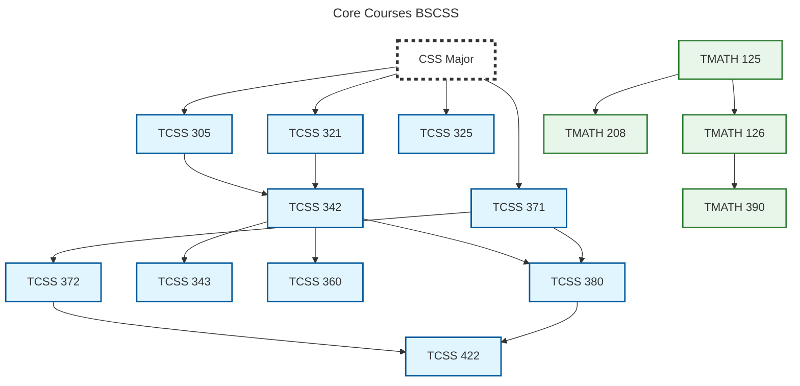

# Course Prerequisite Grapher

A Java-based utility that parses course data to generate visual Directed Acyclic Graphs (DAGs) using Mermaid.js.
It dynamically generates visual flowcharts to help students and advisors visualize complex degree paths.

## Features
- **Cycle Detection:** Depth-first search over every course rejects circular prerequisites in O(V + E).
- **Dynamic Styling:** Automatically colors nodes by course prefix (e.g. `TCSS`, `TMATH`).
- **Major Identification:** Applies a distinct dashed border to "Major" requirement nodes.
- **Safe Mermaid Output:** Course names with characters like `-`, `&`, `.` or `( )` still produce a valid diagram.

## Requirements
- Java 17 or newer (JDK)
- JUnit 5 (only needed to run the tests)

## Getting Started
```bash
git clone https://github.com/jordanen522/Course-Prerequisite-Grapher.git
```

## Usage

### 1. Prepare your Data
The program reads a plain-text CSV file:

- **Line 1** is the diagram title. It is not a header row.
- **Every later line** is one prerequisite pair: `prerequisite,successor`, meaning `prerequisite` must be
  completed before `successor`.

*Example:*
```text
Math Prerequisite Chain
TMATH 124,TMATH 125
TMATH 125,TMATH 126
TMATH 125,TMATH 207
TMATH 125,TMATH 208
TMATH 126,TMATH 390
```

Parsing rules:
- Spaces around each name are trimmed, and blank lines are ignored.
- Rows with fewer than two columns or a blank course name are skipped. Columns after the second are ignored.
- Duplicate rows only count once.
- Course names cannot contain commas.

### 2. Run the Program

#### IntelliJ IDEA
1. Open the `Course-Prerequisite-Grapher` folder in IntelliJ IDEA.
2. Mark `src` as **Sources Root** and `test` as **Test Sources Root** if IntelliJ does not detect them.
3. Place your CSV file in the project root.
4. Run `Main.java`.
5. When prompted in the console, type the name of your CSV file and press Enter.

#### Command Line
From the project root, compile:
```bash
javac -d out src/*.java
```
Then run it and enter a CSV file name (e.g. `CoreCoursesBSCSS.csv`) when prompted:
```bash
java -cp out Main
```

File names are resolved relative to the directory you run the program from. If the file does not exist you
are asked again. If the data contains a cycle the program prints `Error: Data is not a DAG.` and writes nothing.

### 3. View the Output
A file named `OutputGraph.txt` is written to the current directory containing the **Mermaid** syntax.
It is overwritten on every run.
Copy its contents into the [Mermaid Live Editor](https://mermaid.live/) to see the visual graph, or paste them
into a ` ```mermaid ` code block in any Markdown file on GitHub.

## Diagram Rules
- **Prefix colors:** Each node is colored by the first word of its name, so every `TCSS ...` course shares
  one color. Six colors are available. After that, the colors repeat.
- **`None` nodes:** A node named `None` (any capitalization) is drawn without a prefix color.
- **Major nodes:** Any node whose name contains `major` (any capitalization), such as `CSS Major`, is drawn
  white with a thick, dark dashed border. This replaces its prefix color so the major stands out.
- **Node IDs:** Mermaid IDs only allow letters, digits and `_`, so every other character becomes `_`
  (`TCSS 101` → `TCSS_101`). Names that clean up to the same ID get a numeric suffix (`TCSS_101_2`), and a node
  named `end` becomes `n_end` because `end` is reserved in Mermaid. Labels always show the original name.

## Running Tests
The tests use JUnit 5 and live in `test/MainTest.java`.

#### IntelliJ IDEA
Right-click the `test` folder and choose **Run 'All Tests'**. If JUnit is not on the classpath yet, hover over
the red `org.junit` import in `MainTest.java` and choose **Add 'JUnit 5' to classpath**.

#### Command Line
Download the [JUnit console launcher](https://repo1.maven.org/maven2/org/junit/platform/junit-platform-console-standalone/1.14.0/junit-platform-console-standalone-1.14.0.jar)
into a `lib/` folder in the project root (it is gitignored), then compile everything:
```bash
javac -d out -cp lib/junit-platform-console-standalone-1.14.0.jar src/*.java test/*.java
```
And run the tests:
```bash
java -jar lib/junit-platform-console-standalone-1.14.0.jar execute --class-path out --select-class MainTest
```

## Project Structure
```text
Course-Prerequisite-Grapher/
├── src/
│   ├── Course.java          # A course node and its direct successors
│   └── Main.java            # CSV parsing, DAG validation and Mermaid output
├── test/
│   └── MainTest.java        # JUnit 5 tests
├── *BSCSS.csv               # Sample data for the BS in Computer Science and Systems
├── your_file.csv            <-- (Place files here!)
├── OutputGraph.txt          # Generated Mermaid diagram (gitignored)
├── LICENSE
└── README.md
```

Sample data files:

| File | Contents |
| --- | --- |
| `AdmissionRequirementsBSCSS.csv` | Courses required for admission to the major |
| `CoreCoursesBSCSS.csv` | Core courses taken after admission |
| `SeniorElectivesBSCSS.csv` | Senior elective credit requirements |
| `GeneralEducationRequirementsBSCSS.csv` | General education credit requirements |
| `CompleteDegreeBSCSS.csv` | How the requirement groups combine into the full degree |

## Example Output
Below is the generated diagram for `CoreCoursesBSCSS.csv`, the core courses of the CSS major:



## License
This project is licensed under the [MIT License](LICENSE).
